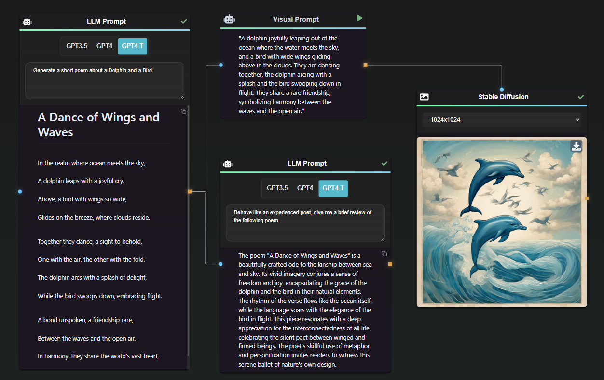
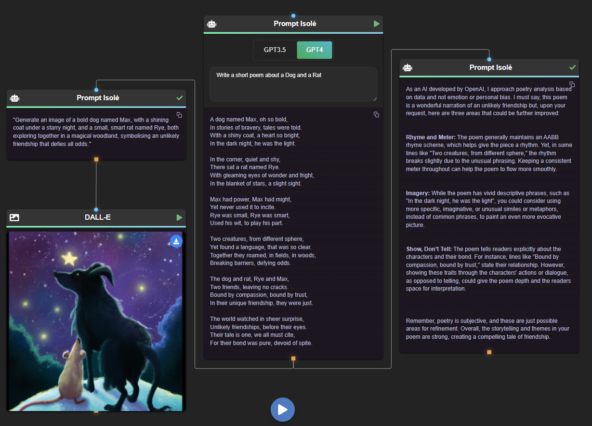

  

  <em>Open-source tool to seamlessly connect multiple AI models in repeatable flow.</em>

    
    
    
    

<a href="https://ai-flow.net/">🔗 Website</a>

<em>While a live demo is available for convenience, for the best experience we recommend running the application directly on your local machine.</em>

**AI Flow** is an open source, user-friendly UI application that empowers you to seamlessly connect multiple AI models together, specifically leveraging the capabilities of **ChatGPT**. This unique tool paves the way to creating interactive networks of different AI models, fostering a multi-perspective response to various prompts.

Imagine setting up a simple workflow where:

- One node generates a poem
- One node gives a review of the poem
- One node creates a prompt for the cover of the poem
- One node makes the cover with Stable Diffusion

If we want to change the idea of the poem, we can edit the first node, and keep the same flow. 

This flow logic can then be applied to different inputs, yielding varied results for similar subject matter. 

**AI Flow is particularly useful for content creation.** By enabling different GPT models to adopt different roles, AI Flow orchestrates the creation and evaluation of digital content, from social media threads to blog articles. 

Our primary goal with AI Flow is to democratize access to AI interactions, enabling anyone to create and manage their own AI networks right from their personal computer. In addition, we value your autonomy and control over costs. With AI Flow, you utilize your own OpenAI keys, giving you full authority over your budget. Importantly, the software runs locally on your machine, assuring you of privacy and control over your data and operations.

⚠️ Please note that AI Flow is still under active development. At present, it is constrained by the maximum input size supported by GPT models. However, we're hard at work devising solutions to this limitation, and we're excited about rolling out updates in future releases.

## Features

In a nutshell, AI Flow provides a visual platform for crafting and managing AI-driven workflows, thereby facilitating diverse and dynamic AI interactions.

- 🎨 It offers a drag-and-drop interface to design these workflows
- 📊 Monitors their execution in real-time
- 🗂️ AI models can be conveniently managed and organized
- 💾 Workflows can be exported or imported for sharing or backup purposes

## Other basic use cases

#### Summarize web pages & youtube transcript

#### Split input with AI 

> By combining those features we can create different flows.

## Installation (Windows executable)

For a quick local setup, grab the .exe from the [repository's releases section](https://github.com/DahnM20/ai-flow/releases).

## Installation (without Docker)

### Prerequisites

Before getting started, make sure you have the following dependencies installed on your system:

- [Python (version 3.9.5 or later)](https://www.python.org/downloads/)
- [Poetry (version 1.4.2 or later)](https://python-poetry.org/docs/#installation)
- [Node.js (version 16.13.0 or later)](https://nodejs.org/en/download/)

### Clone the Repository

1. Clone the repository: `git clone https://github.com/DahnM20/ai-flow.git`
2. Change to the project directory: `cd ai-flow`

### UI Dependencies
1. Go to the UI directory: `cd packages/ui`
2. Install dependencies: `npm install`

### Backend Dependencies
1. Go to the backend directory: `cd packages/backend`
2. Install Python dependencies: `poetry install`
   
### For Windows only
3. Launch poetry shell : `poetry shell`
4. Install the windows requirements in the poetry shell : `pip install -r requirements_windows.txt`

## Usage

1. Start the backend server: `cd backend && poetry run python server.py`
2. Start the ui application: `cd ui && npm start`
3. Open your browser and navigate to `http://localhost:3000`
4. Use the drag-and-drop interface to design your AI workflow
5. Connect AI models and define data flow between them
6. Click "Run" to execute the AI workflow
7. Monitor the execution progress and results in real-time

## 🐳 Docker

### Docker Compose

1. Go to the docker directory: `cd ./docker`
2. Update the .yml if needed for the PORTS
3. Launch `docker-compose up` or `docker-compose up -d`
4. Open your browser and navigate to `http://localhost:3000`
5. Use `docker-compose stop` when you want to stop the app. 

## Contributing

Contributions are welcome! If you find any issues or have suggestions for improvement, please open an issue or submit a pull request.

## License

This project is licensed under the MIT License. See the [LICENSE](LICENSE) file for more details.
