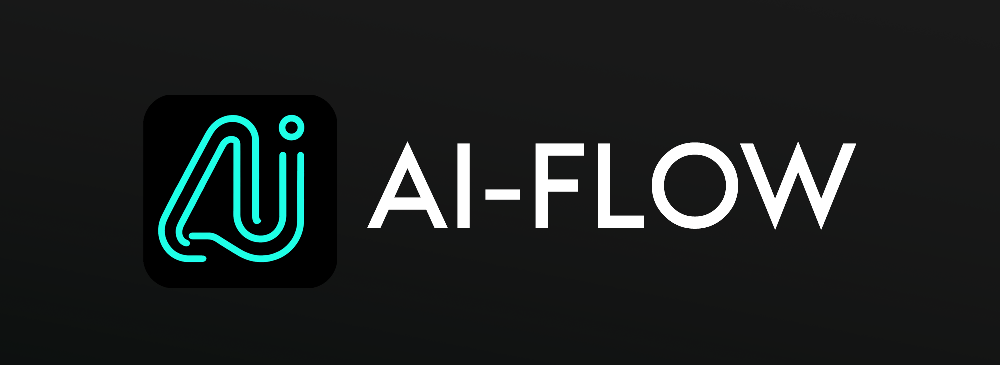
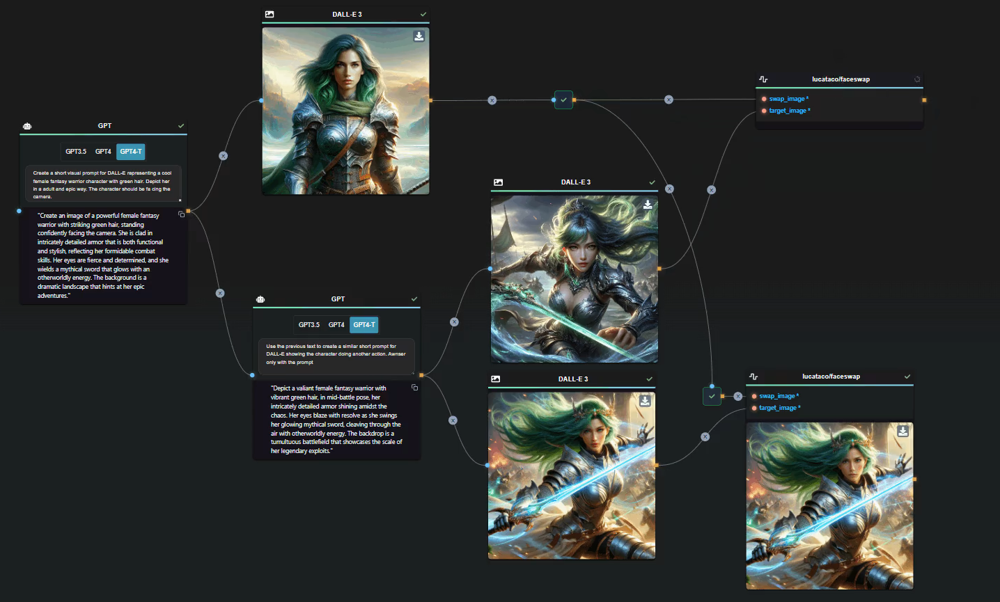
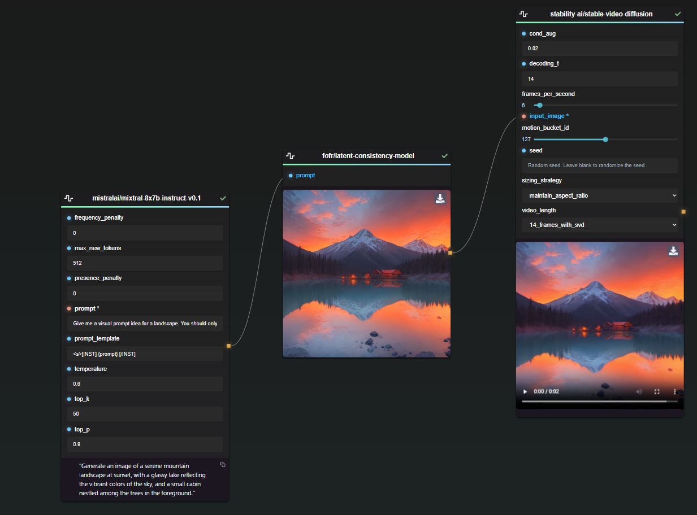
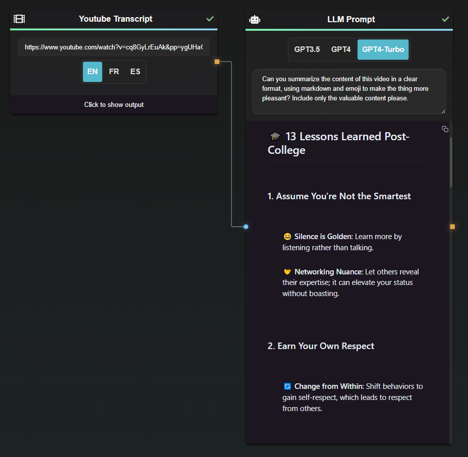
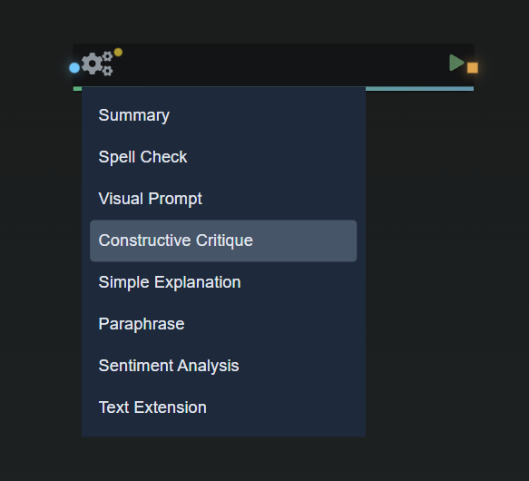
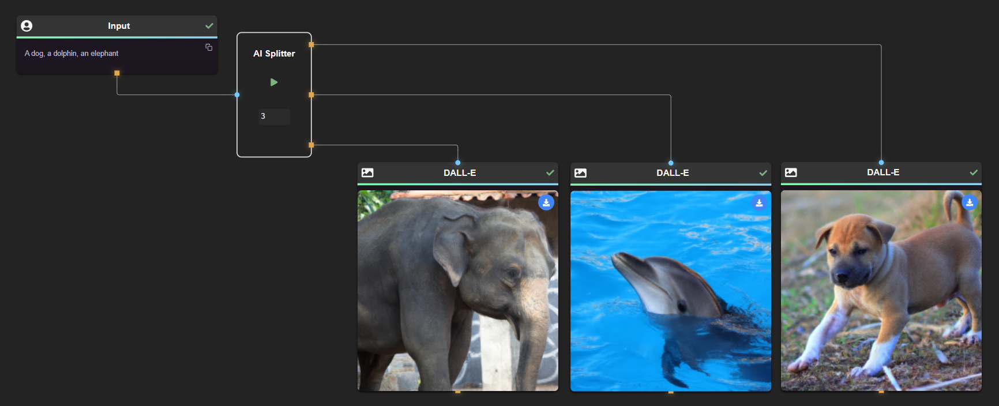
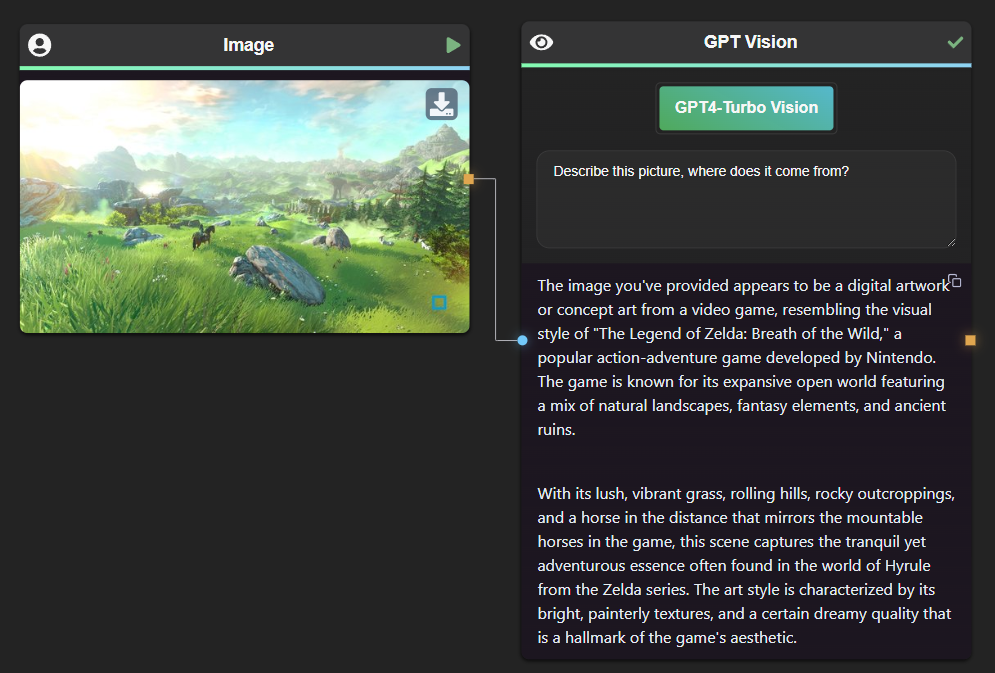
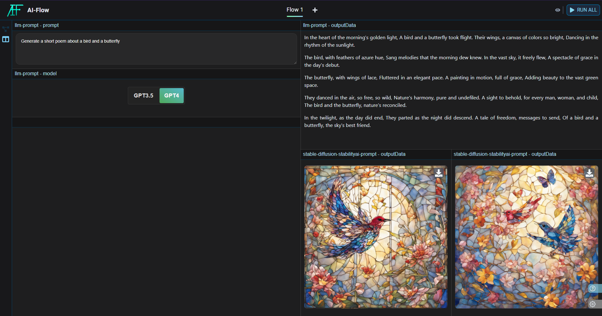

  

  <em>Open-source tool to seamlessly connect multiple AI model APIs in repeatable flow.</em>

    
    
    
    
    

<a href="https://ai-flow.net/">🔗 Website</a>

<em>While a live version is available for convenience, for the best experience we recommend running the application directly on your local machine.</em>

## 🎉🚀 v0.6.1 is Now Available 🚀🎉

🚀 **New Replicate Node** | ✨ **Access to a lot of open-source models   (LLama, Mistral, Face Swap, MusicGen, ...)**
 
🌟 **New Edge Type Button** | 🎵 **Support for audio output**

---

**AI Flow** is an open source, user-friendly UI application that empowers you to seamlessly connect multiple AI models together, specifically leveraging the capabilities of multiples AI APIs such as OpenAI, StabilityAI and Replicate. This unique tool paves the way to creating interactive networks of different AI models, fostering a multi-perspective response to various prompts.

## Features

In a nutshell, AI Flow provides a visual platform for crafting and managing AI-driven workflows, thereby facilitating diverse and dynamic AI interactions.

- 🎨 It offers a drag-and-drop interface to design these workflows
- 📊 Monitors their execution in real-time
- Nodes are launched in parallel whenever it's possible
- 🗂️ AI models can be conveniently managed and organized
- 💾 Workflows can be exported or imported for sharing or backup purposes

## Other basic use cases

#### Run a diverse range of open-source models through the Replicate API

LLaMA, Mistral, Stable Video Diffusion, Music-gen, and many more.

#### Summarize web pages & youtube transcript

#### Use pre-made prompts to build quickly

#### Split input with AI

#### Describe picture with AI

#### Create a custom layout for your flow

When your flow is complete, you have the option to run it as is or create a custom layout focusing on the most interesting parts.

Here is an example of layout :

## Installation (Windows executable)

For a quick local setup, grab the .exe from the [repository's releases section](https://github.com/DahnM20/ai-flow/releases).

You'll need to update the REPLICATE_API_KEY in the .env file to use the Replicate Node. This API key is used exclusively for fetching model data.

## Installation (without Docker)

### Prerequisites

Before getting started, make sure you have the following dependencies installed on your system:

- [Python (version 3.9.5 or later)](https://www.python.org/downloads/)
- [Poetry (version 1.4.2 or later)](https://python-poetry.org/docs/#installation)
- [Node.js (version 16.13.0 or later)](https://nodejs.org/en/download/)

### Clone the Repository

1. Clone the repository: `git clone https://github.com/DahnM20/ai-flow.git`
2. Change to the project directory: `cd ai-flow`

### UI Dependencies

1. Go to the UI directory: `cd packages/ui`
2. Install dependencies: `npm install`

### Backend Dependencies

1. Go to the backend directory: `cd packages/backend`
2. Install Python dependencies: `poetry install`

### For Windows only

3. Launch poetry shell : `poetry shell`
4. Install the windows requirements in the poetry shell : `pip install -r requirements_windows.txt`

## Usage

You'll need to update the REPLICATE_API_KEY in the .env file to use the Replicate Node. This API key is used exclusively for fetching model data.

1. Start the backend server: `cd backend && poetry run python server.py`
2. Start the ui application: `cd ui && npm start`
3. Open your browser and navigate to `http://localhost:3000`
4. Use the drag-and-drop interface to design your AI workflow
5. Connect AI models and define data flow between them
6. Click "Run" to execute the AI workflow
7. Monitor the execution progress and results in real-time

## 🐳 Docker

### Docker Compose

1. Go to the docker directory: `cd ./docker`
2. You'll need to update the REPLICATE_API_KEY in the .yml file to use the Replicate Node. This API key is used exclusively for fetching model data.
3. Launch `docker-compose up` or `docker-compose up -d`
4. Open your browser and navigate to `http://localhost:80`
5. Use `docker-compose stop` when you want to stop the app.

## Contributing

Contributions are welcome! If you find any issues or have suggestions for improvement, please open an issue or submit a pull request.

## License

This project is licensed under the MIT License. See the [LICENSE](LICENSE) file for more details.
